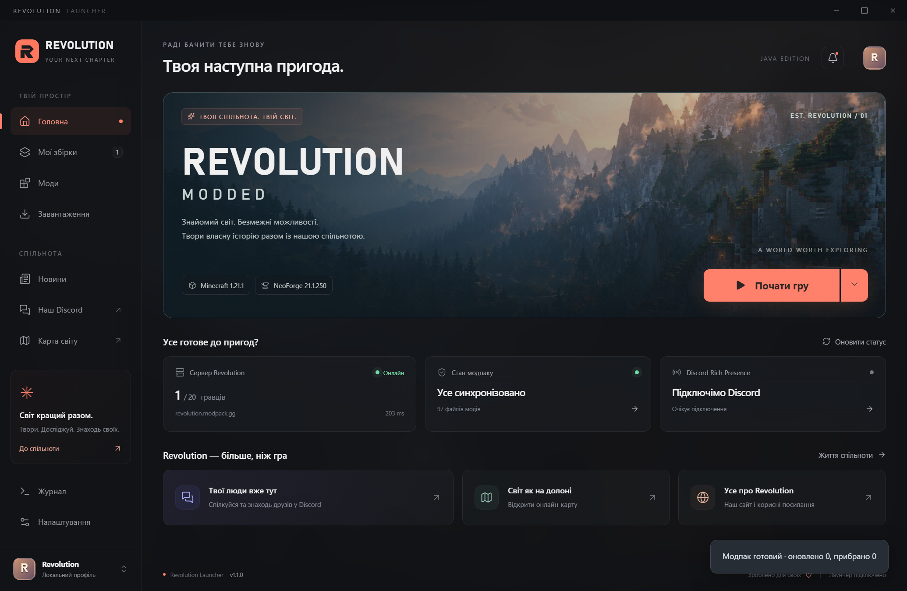

# Revolution Launcher

**Твоя спільнота. Твій світ.**

Український Windows-лаунчер для Revolution Modded: Minecraft **1.21.1**, NeoForge **21.1.250**, Java **21**.

[Discord](https://discord.com/invite/R3bDcSBv52) · [Репозиторій](https://github.com/idenoff-cmyk/revolution-launcher-updates) · [Архітектура](docs/ARCHITECTURE.md) · [Перевірки](docs/QA.md)



## Запуск

1. Розпакуй Windows ZIP повністю.
2. Запусти `Revolution.exe`. Збережи поруч `_internal`, `modpack` та `community.json`.
3. Лаунчер сам встановить і перевірить **97 модів із комплекту** в окремій папці.
4. Обери профіль гравця й натисни **Почати гру**. Java, Minecraft та NeoForge завантажуються під час першої підготовки.

Python, Node.js та окремий Qt користувачу не потрібні. Потрібен інтернет для підготовки гри та кілька гігабайтів вільного місця. Дані: `%LOCALAPPDATA%\RevolutionLauncher`.

**Стан версії 1.1.0:** готовий EXE запускається на Windows, автоматично встановлює 97 модів і проходить перевірку інтерфейсу. 66 автоматичних тестів та 393 перевірки залежностей пройдено. Тестовий запуск гри поза Codex успішний: NeoForge встановлений, Minecraft ініціалізував клієнт і завершився з кодом 0. Вхід Microsoft та гру на сервері ще потрібно перевірити власнику акаунту. Докладніше — [QA](docs/QA.md).

## Можливості

- Темний український інтерфейс із розмитим фоном, переходами, зменшенням анімації та живими статусами.
- Справжній Server List Ping, онлайн, версія та DNS SRV для `revolution.modpack.gg`.
- Автоматична перевірка модпаку при відкритті, кожні 15 хвилин у простої та перед запуском гри.
- Підписані Ed25519 релізи, SHA-256 файлів, зафіксовані залежності та відхилення старих ревізій.
- Транзакційне оновлення: файли перевіряються перед заміною, перервана заміна відновлюється з журналу.
- Спільний кеш за хешами; ізольовані інстанси отримують окремі копії.
- Microsoft OAuth із PKCE та локальні профілі; секрети в Windows Credential Manager.
- Виявлення й завантаження Java, ліміт RAM, пресети JVM; власні сучасні та legacy-інстанси.
- Revolution Assist: локальна діагностика крашів, очищений звіт, необов’язковий аналіз через Gemini або Ollama.
- Modrinth / CurseForge для зафіксованих файлів, RSS/Atom, Discord Rich Presence після налаштування.

## Оновлення спільноти

Пропозиція у Discord → кандидат збірки → перевірка залежностей і тест на сервері → підпис → GitHub Release → оновлення клієнтів.

Клієнт не змінює файли, поки Minecraft працює. Видаляються лише файли, якими керував попередній реліз. Світи, скріншоти та власні моди залишаються. За недоступності налаштованого каналу запуск зупиняється з поясненням, щоб не приєднатися із невідомою версією модпаку.

Перший [підписаний реліз модпаку](https://github.com/idenoff-cmyk/revolution-launcher-updates/releases/tag/pack-r1) опублікований. Канал уже налаштовано в `community.json` комплекту. Клієнт отримує схвалені оновлення з GitHub; публікація наступних ревізій не потребує перевипуску EXE.

[Інструкція адміністратора](docs/UPDATES.md) · [Формат маніфесту](docs/MANIFEST.md) · [Перелік модів](docs/MODPACK.md)

## Акаунти та інтеграції

Microsoft Application ID уже налаштовано: `6a13d8b7-ae7a-4772-bf45-47051eb16dee`. Це публічний ідентифікатор. Для нього потрібні personal Microsoft accounts, public-client потік, redirect URI `http://localhost:59174/callback` і дозвіл Minecraft API. Client secret не використовується. Фактичний вхід перевіряється власником акаунту з Minecraft Java.

Локальний профіль придатний для одиночної гри та серверів, які дозволяють офлайн-вхід. Адреса Discord уже вказана. Для Rich Presence потрібен окремий Discord Application ID; URL запрошення його не замінює. Карта, сайт, RSS та maintenance JSON налаштовуються за наявності сервісів.

CurseForge API key потрібен лише для маніфестів із цим джерелом без прямого URL. Обмеження автора на завантаження дотримуються.

## Допомога з крашами

Відкрий **Журнал → Перевірити логи**. Картки показують ознаку помилки, рядок-доказ і наступну дію. При невдалому запуску звіт створюється автоматично.

Для ШІ обери сервіс і модель у **Налаштування → Помічник**. Логи передаються лише після перегляду звіту та натискання відповідної кнопки. Ollama потребує локальної моделі; Gemini — власного API key. Модель не має інструментів зміни файлів чи виконання команд.

[Можливості й приватність помічника](docs/ASSISTANT.md)

## Розробка

```powershell
py -3.12 -m venv .venv
.\.venv\Scripts\python.exe -m pip install -r requirements.txt
.\.venv\Scripts\python.exe main.py
```

Скопіюй `modpack` із Windows-комплекту поруч із `main.py`, щоб запуск із коду встановлював локальну збірку. Вихідний код не дублює JAR-файли.

```powershell
.\.venv\Scripts\python.exe -m pip install pyinstaller==6.22.2 pytest==9.1.1
.\.venv\Scripts\python.exe -m pytest -q
.\.venv\Scripts\python.exe -m PyInstaller Revolution.spec --noconfirm
```

Після пакування скопіюй `modpack` і `community.json` поруч із EXE у `dist/Revolution`. `--data-dir D:\RevolutionData` обирає окрему папку даних. `--debug` відкриває локальний DevTools 9224; звичайний запуск його не відкриває.

Код лаунчера — MIT. Qt, Chromium, Python-бібліотеки та моди мають власні ліцензії. Minecraft, NeoForge й Java завантажуються окремо. [Сторонні компоненти](docs/THIRD_PARTY.md). Неофіційний застосунок; не схвалений Mojang або Microsoft.
